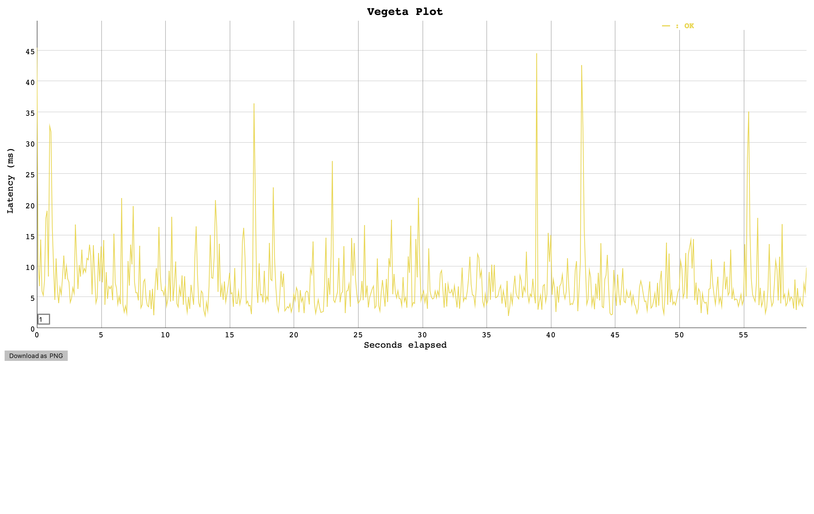
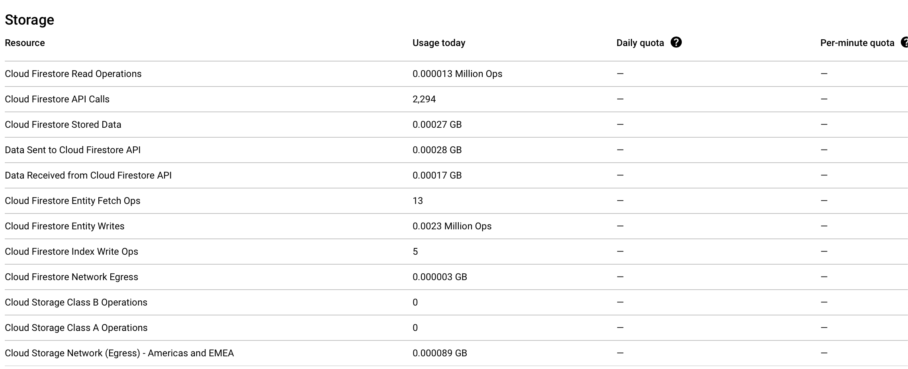

## Task 3: Test the performance of Datastore writes

In this task you will performance test the App Engine platform with a
load generator. You will compare the performance of normal request
processing and request processing that involves Datastore write
operations.

As the Servlets are deployed with Automatic Scaling, there is a danger
of consuming a lot of resources while testing, and burning through a
lot of money. Google gave you a coupon with some money that was put
into a billing account. Projects can have spending limits, but by
default it is unlimited. Before starting the performance test, you
have to set a reasonable daily spending limit.

Set a daily spending limit on the project as follows:

- In the Cloud Platform console navigate to **App Engine** >
  **Settings**. Click on **Edit**. Enter a daily spending limit of
  **$1.00**. (Note: Google has removed this functionality in January 2020. There is no replacement for it yet. Skip this step, but observe how many credits you have left before and after the performance tests. You can also limit the number of instances with an optional configuration of the autoscaling algorithm: In the file `appengine-web.xml` in the `<automatic-scaling>` element add a `<max-instances>` element with a small value (3, 4, ...). See <https://cloud.google.com/appengine/docs/standard/java/config/appref#scaling_elements>. An alternative is to use **Budgets & alerts**. In the Cloud Platform console navigate to **Billing** > **Budgets & alerts**. Create a new budget for the month for an amount of **$1.00** and optionally set the actions associated with the alert.)

Conduct the performance tests as follows:

1. You should already have vegeta installed from previous labs. If not, see <https://blog.absyah.dev/super-simple-guide-for-load-testing-using-vegeta#heading-install-vegeta>.

2. First test the performance of normal request processing using the
   Servlet generated by the wizard.

   - Prepare an "attack" using vegeta.

   - In the App Engine console open the **Dashboard**.

   - Run the attack.

   - In the dashboard observe the graph of the incoming requests, the
     number of instances and the latency.

3. Test the performance of the Servlet that writes to the Datastore.

4. At the end of the tests observe in detail how much resources were
   used. In the console click on **Quota Details**.

5. If you are running out of resources because of the monthly spending
   limit, increase it carefully by a dollar or two.

Deliverables:

- For each performance test, write the command used to generate the attack with vegeta and copy the file generated by the vegeta plot command.

  ```
  //TODO command used
  //  echo "GET http://20240425t152107-dot-core-appliance-420713.ew.r.appspot.com/datastorewrite?_kind=book&_key=837094&author=John%20Steinbeck&title=The%20Grapes%20of%20Wrath" | vegeta attack -rate=10 -duration=60s | tee results.bin | vegeta report
  (base) valbu@MacBook-Pro-de-Bugna WSI_VBU_CLD24 % echo "GET http://localhost:8080/datastorewrite?_kind=book&_key=837094&author=John%20Steinbeck&title=The%20Grapes%20of%20Wrath" | vegeta attack -rate=10 -duration=60s | tee results.bin | vegeta report
  
  Requests      [total, rate, throughput]         600, 10.02, 10.02
  Duration      [total, attack, wait]             59.91s, 59.9s, 9.809ms
  Latencies     [min, mean, 50, 90, 95, 99, max]  1.97ms, 7.25ms, 5.763ms, 12.81ms, 15.995ms, 32.551ms, 45.463ms
  Bytes In      [total, mean]                     56400, 94.00
  Bytes Out     [total, mean]                     0, 0.00
  Success       [ratio]                           100.00%
  Status Codes  [code:count]                      200:600  
  Error Set:

  cat results.bin | vegeta plot > plot.html
  ```

  ```
  //TODO copy/link file generated by vegeta plot command
  ```
  
  # Local
  
  # Deployment
  

 
- What response times do you observe for each Servlet?
  
  ```
  Ces graphiques représentent le temps qui est nécessaire pour traiter une requête.
  En comparant ces deux images, nous pouvons nous apercevoir que le range des valeurs n'est pas le même entre le déploiement local et sur Google cloud
  
  Pour la version locale, le spectre de valeur s'étend entre 3 ms et 45 ms. Pour la version déploiement, le spectre de valeur varie entre 40 ms et 200 ms

  En outre, cela signifie que la version déploiement prend plus de temps à traiter une requête que la version local. Cela est tout à fait normal, car la version déploiement doit échanger avec Google Cloud Console.
  ```
  
- Compare the response times shown by vegeta with the App Engine
  console. Explain the difference.

  


  ```
  En comparaison avec les graphiques générés par l'outil Vegeta, nous pouvons constater que le temps nécessaire pour réaliser notre série d'attaques prend plus de temps que prévu.

  En effet, selon notre commande notre attaque doit durer 1 minute et en réalité (selon le graphique) elle dure environ 5 minutes.
  ```

- How many resources have you used to run these tests? From the
  **Quota Details** view of the console determine the non-zero resource
  quotas (**Daily quota** different from 0%). Explain each with a sentence.
  To get a sense of everything that is measured click on **Show resources not in use**.

  ```
Voici une explication de chaque ressource listée et de son utilisation :

**1. Cloud Firestore Read Operations**: 0.000013 million d'opérations ont été effectuées aujourd'hui, ce qui est en dessous de tout quota quotidien ou par minute, indiquant une utilisation normale sans atteindre de limite de quota.  

**2. Cloud Firestore API Calls**: 2 294 appels ont été faits, ce qui est en dessous de tout quota quotidien ou par minute, ce qui indique une utilisation normale sans dépasser de quota.  

**3. Cloud Firestore Stored Data**: 0.00027 GB de données sont actuellement stockées, sans atteindre de quota, montrant une utilisation légère de l'espace de stockage Firestore.  

**4. Data Sent to Cloud Firestore API** : 0.00028 GB de données ont été envoyées à Firestore aujourd'hui, ce qui ne dépasse aucun quota établi.  

**5. Data Received from Cloud Firestore API**: 0.00017 GB de données ont été reçues de Firestore, également en dessous de tout quota quotidien.  

**6. Cloud Firestore Entity Fetch Ops**: 13 opérations de récupération d'entité ont été réalisées, une quantité minime qui reste dans les limites normales d'utilisation.  

**7. Cloud Firestore Entity Writes** : Il y a eu 0.0023 million d'opérations d'écriture sur des entités aujourd'hui, ce qui reste en dessous de tout quota.  

**8. Cloud Firestore Index Write Ops** : Seulement 5 opérations d'écriture d'index ont été comptabilisées, indiquant une utilisation très basse de cette ressource.

**9. Cloud Firestore Network Egress**: Un très faible volume de données de 0.000003 GB a quitté le réseau Firestore, ce qui est loin de dépasser un quelconque quota.  

**10. Cloud Storage Network (Egress) - Americas and EMEA**: Il y a eu une très petite quantité de données, 0.000089 GB, qui ont été transférées hors du Cloud Storage, mais cela reste en dessous de tout quota.  
  ```


- Let's suppose you become suspicious that the algorithm for the automatic scaling of
  instances is not working correctly. Imagine a way in which the algorithm could be broken. Which measures shown in the console would you use to detect this failure?

  ```
  Lorsque des suspicions émergent concernant le dysfonctionnement de l'algorithme de mise à l'échelle automatique des instances, plusieurs indicateurs clés doivent être surveillés. Le nombre d'instances devrait varier proportionnellement au trafic entrant ; une corrélation absente pourrait signaler une anomalie. Des augmentations significatives de la latence ou du taux d'erreur peuvent également refléter une incapacité des instances à gérer la charge de travail, suggérant que la mise à l'échelle ne se produit pas adéquatement. Par ailleurs, une utilisation élevée et soutenue des ressources CPU indique potentiellement que l'ajout d'instances supplémentaires est nécessaire pour distribuer efficacement la charge. Enfin, une consommation rapide des quotas et l'accumulation de requêtes dans la file d'attente sans augmentation du nombre d'instances pourraient confirmer des défaillances dans l'algorithme de mise à l'échelle automatique. Ces mesures, examinées conjointement, sont essentielles pour diagnostiquer l'efficacité de la mise à l'échelle en réponse aux variations de la demande.
  ```

## Troubleshooting

If your Servlet that writes to the Datastore works OK on your local
machine, but you get a server error when running it in the Google
cloud, have a look at the logs (hamburger menu > Logs). If you see a
NoClassDefFoundError related to the Datastore you have run into a
[problem that was reported to Google on March 22, 2018](https://issuetracker.google.com/issues/76144204). The
problem is that the library for the Datastore,
`appengine-api-1.0-sdk`, is missing. Previously it was automatically
included by Google.

Here is a workaround:

- Create a new project (Google App Engine Standard Environment) that
  has Maven activated (option on the first screen of the wizard).
- Edit the file `pom.xml`: In the dependency declaration for
  `appengine-api-1.0-sdk` change the scope from `provided` to
  `compile` (this will include the dependency in the jar that is
  uploaded to Google).
- _Clean_ the project.
