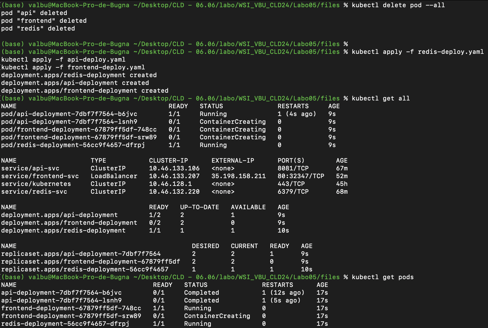

# Task 3 - Add and exercise resilience

By now you should have understood the general principle of configuring, running and accessing applications in Kubernetes. However, the above application has no support for resilience. If a container (resp. Pod) dies, it stops working. Next, we add some resilience to the application.

## Subtask 3.1 - Add Deployments

In this task you will create Deployments that will spawn Replica Sets as health-management components.

Converting a Pod to be managed by a Deployment is quite simple.

  * Have a look at an example of a Deployment described here: <https://kubernetes.io/docs/concepts/workloads/controllers/deployment/>

  * Create Deployment versions of your application configurations (e.g. `redis-deploy.yaml` instead of `redis-pod.yaml`) and modify/extend them to contain the required Deployment parameters.

  * Again, be careful with the YAML indentation!

  * Make sure to have always 2 instances of the API and Frontend running. 

  * Use only 1 instance for the Redis-Server. Why?

    > Utilisez seulement 1 instance pour Redis car c’est une base de données qui ne doit pas avoir de multiples instances en écriture pour éviter les conflits de synchronisation.

  * Delete all application Pods (using `kubectl delete pod ...`) and replace them with deployment versions.

  * Verify that the application is still working and the Replica Sets are in place. (`kubectl get all`, `kubectl get pods`, `kubectl describe ...`)

## Subtask 3.2 - Verify the functionality of the Replica Sets

In this subtask you will intentionally kill (delete) Pods and verify that the application keeps working and the Replica Set is doing its task.

Hint: You can monitor the status of a resource by adding the `--watch` option to the `get` command. To watch a single resource:

```sh
$ kubectl get <resource-name> --watch
```

To watch all resources of a certain type, for example all Pods:

```sh
$ kubectl get pods --watch
```

You may also use `kubectl get all` repeatedly to see a list of all resources.  You should also verify if the application stays available by continuously reloading your browser window.

  * What happens if you delete a Frontend or API Pod? How long does it take for the system to react?
    > Kubernetes détecte la suppression du Pod presque instantanément grâce au kube-apiserver qui est constamment informé des changements dans l'état du cluster.

    > Le Pod est marqué pour suppression. Kubernetes envoie un signal de terminaison (graceful termination) au Pod, permettant aux conteneurs de s'arrêter proprement. Ce délai de terminaison est configurable et par défaut, il est de 30 secondes. Cependant, si le Pod ne se termine pas dans ce délai, il est forcé à se terminer.

    > Si le Pod appartient à un ReplicaSet ou un Deployment, le contrôleur de ReplicaSet ou de Deployment remarque la réduction du nombre de Pods et crée immédiatement un nouveau Pod pour maintenir l'état désiré.

    > Le temps de réaction total varie mais est généralement assez rapide : 
Détection et suppression du Pod : Quelques secondes à une minute, incluant le délai de terminaison configuré. Création et démarrage d'un nouveau Pod : De quelques secondes à plusieurs minutes, selon les circonstances mentionnées ci-dessus.
    
  * What happens when you delete the Redis Pod?

    > Il se passe la même chose que pour un pod API ou Frontend. Toutefois, Pendant le processus de remplacement, il peut y avoir une perturbation temporaire des services qui dépendent de Redis, surtout si le Pod supprimé était un nœud unique sans haute disponibilité configurée. De plus, si Redis est déployé avec une configuration de haute disponibilité, d'autres nœuds Redis peuvent prendre le relais pendant la transition, minimisant ainsi l'impact.
    
    
  * How can you change the number of instances temporarily to 3? Hint: look for scaling in the deployment documentation

    > kubectl scale deployment api-deployment --replicas=3
kubectl scale deployment frontend-deployment --replicas=3
    
  * What autoscaling features are available? Which metrics are used?

    > 1. Horizontal Pod Autoscaler (HPA)
 
Le HPA ajuste automatiquement le nombre de pods dans un déploiement ou un replicaset en fonction de l’observation de certaines métriques comme l’utilisation du CPU ou la mémoire. Voici les détails :
 
	•	Métriques Utilisées :
	•	CPU Utilization : C’est la métrique la plus courante. Le HPA ajuste le nombre de réplicas pour maintenir l’utilisation cible du CPU que vous spécifiez.
	•	Memory Utilization : Semblable à l’utilisation du CPU, mais basée sur la consommation de mémoire.
	•	Custom Metrics : Avec l’API des métriques personnalisées, Kubernetes permet également de scaler basé sur des métriques définies par l’utilisateur, qui peuvent être collectées de sources externes ou des métriques internes de l’application.
 
2. Vertical Pod Autoscaler (VPA)
 
Le VPA ajuste les demandes de CPU et de mémoire des conteneurs dans un pod et les redémarre avec les nouvelles limites si nécessaire.
 
	•	Métriques Utilisées :
	•	CPU et mémoire : Le VPA révise les limites de CPU et de mémoire basées sur l’utilisation historique, ce qui peut aider à optimiser l’utilisation des ressources sans sous-provisionner ou sur-provisionner de manière significative.
 
3. Cluster Autoscaler
 
Le Cluster Autoscaler ajuste automatiquement la taille d’un cluster Kubernetes pour que tous les pods aient un endroit où s’exécuter et qu’il n’y ait pas trop de nœuds inutilisés.
 
	•	Métriques Utilisées :
	•	Demande totale de ressources par les pods par rapport à la capacité du cluster. Si des pods ne peuvent pas être schedulés en raison d’un manque de ressources, le Cluster Autoscaler peut demander à ajouter des nœuds. Inversement, si des nœuds sont sous-utilisés, il peut en réduire le nombre.
 
4. Custom Autoscaler
 
Pour des besoins spécifiques, des autoscalers personnalisés peuvent être développés pour utiliser n’importe quelle métrique que vous choisissez, par exemple, le nombre de requêtes en file d’attente, les temps de réponse des applications, etc.
    
  * How can you update a component? (see "Updating a Deployment" in the deployment documentation)

    > kubectl apply -f <fichier.yaml>

## Subtask 3.3 - Put autoscaling in place and load-test it

On the GKE cluster deploy autoscaling on the Frontend with a target CPU utilization of 30% and number of replicas between 1 and 4. 

Load-test using Vegeta (500 requests should be enough).

> [!NOTE]
>
> - The autoscale may take a while to trigger.
>
> - If your autoscaling fails to get the cpu utilization metrics, run the following command
>
>   - ```sh
>     $ kubectl apply -f https://github.com/kubernetes-sigs/metrics-server/releases/latest/download/components.yaml
>     ```
>
>   - Then add the *resources* part in the *container part* in your `frontend-deploy` :
>
>   - ```yaml
>     spec:
>       containers:
>         - ...:
>           env:
>             - ...:
>           resources:
>             requests:
>               cpu: 10m
>     ```
>

## Deliverables

Document your observations in the lab report. Document any difficulties you faced and how you overcame them. Copy the object descriptions into the lab report.

> // TODO

```````sh
// TODO object descriptions
```````

```yaml
# redis-deploy.yaml
```

```yaml
# api-deploy.yaml
```

```yaml
# frontend-deploy.yaml
```
